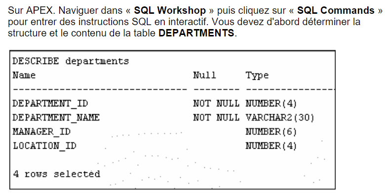
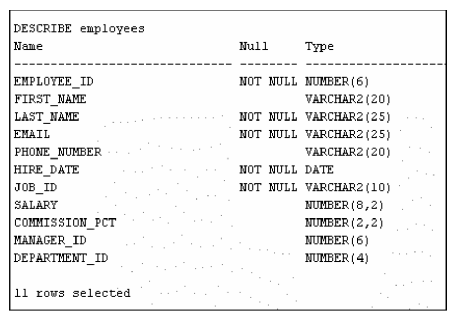

# TP SQL 2024
###### Groupe composé d'Alexy VANOT et de Darel MARTIN

## Première partie

### 1.1 Exercice 1
1. L'instruction SELECT suivante est-elle exécutée avec succès : (oui/non) ? 
```sql
SELECT last_name, job_id, salary AS Sal 
FROM employees;
```
> oui

2. L'instruction SELECT suivante est-elle exécutée avec succès: (oui/non) ?
```sql
SELECT * 
FROM job_grades; 
```
> oui

3. L'instruction suivante présente quatre erreurs de codage. Pouvez-vous les identifier ? 
```sql
SELECT employee_id, last_name 
sal x 12 ANNUAL SALARY 
FROM employees;
```
> 1ere erreur : il manque une virgule après last_name
> 2eme erreur : il manque le '_' entre ANNUAL et SALARY
> 3eme erreur : 'x' n'est pas un opérateur valide, il faut utiliser '*'
> 4eme erreur : sal n'est pas une colonne de la table employees
> warning : il manque un 'AS' avant ANNUAL_SALARY
>
> Correction :
> ```sql
> SELECT employee_id, last_name, salary * 12 AS ANNUAL_SALARY
> FROM employees;
> ```

### 1.2 Exercice 2


> Determination de la **structure** de la table departments
> ```sql
> desc departments;
> ```
| Table       | Column          | Data Type | Length | Precision | Scale | Primary Key | Nullable | Default | Comment                                                                                                                                                                               |
|-------------|-----------------|-----------|--------|-----------|-------|-------------|----------|---------|---------------------------------------------------------------------------------------------------------------------------------------------------------------------------------------|
| DEPARTMENTS | DEPARTMENT_ID   | NUMBER    | -      | 4         | 0     | 1           | -        | -       | Primary key column of departments table.                                                                                                                                              |
|             | DEPARTMENT_NAME | VARCHAR2  | 30     | -         | -     | -           | NOT NULL | -       | A not null column that shows name of a department. Administration, Marketing, Purchasing, Human Resources, Shipping, IT, Executive, Public Relations, Sales, Finance, and Accounting. |
|             | MANAGER_ID      | NUMBER    | -      | 6         | 0     | -           | NULLABLE | -       | Manager_id of a department. Foreign key to employee_id column of employees table. The manager_id column of the employee table references this column.                                 |
|             | LOCATION_ID     | NUMBER    | -      | 4         | 0     | -           | NULLABLE | -       | Location id where a department is located. Foreign key to location_id column of locations table.                                                                                      |

> Determination du **contenu** de la table departments
> ```sql
> SELECT * FROM departments;
> ```
| DEPARTMENT_ID | DEPARTMENT_NAME      | MANAGER_ID | LOCATION_ID |
|---------------|----------------------|------------|-------------|
| 10            | Administration       | 200        | 1700        |
| 20            | Marketing            | 201        | 1800        |
| 30            | Purchasing           | 114        | 1700        |
| 40            | Human Resources      | 203        | 2400        |
| 50            | Shipping             | 121        | 1500        |
| 60            | IT                   | 103        | 1400        |
| 70            | Public Relations     | 204        | 2700        |
| 80            | Sales                | 145        | 2500        |
| 90            | Executive            | 100        | 1700        |
| 100           | Finance              | 108        | 1700        |
| 110           | Accounting           | 205        | 1700        |
| 120           | Treasury             |            | 1700        |
| 130           | Corporate Tax        |            | 1700        |
| 140           | Control And Credit   |            | 1700        |
| 150           | Shareholder Services |            | 1700        |
| 160           | Benefits             |            | 1700        |
| 170           | Manufacturing        |            | 1700        |
| 180           | Construction         |            | 1700        |
| 190           | Contracting          |            | 1700        |
| 200           | Operations           |            | 1700        |
| 210           | IT Support           |            | 1700        |
| 220           | NOC                  |            | 1700        |
| 230           | IT Helpdesk          |            | 1700        |
| 240           | Government Sales     |            | 1700        |
| 250           | Retail Sales         |            | 1700        |
| 260           | Recruiting           |            | 1700        |
| 270           | Payroll              |            | 1700        |



> Determination de la **structure** de la table employees
> ```sql
> desc employees;
> ```
| Table     | Column         | Data Type | Length | Precision | Scale | Primary Key | Nullable | Default | Comment                                                                                                                                                                                 |
|-----------|----------------|-----------|--------|-----------|-------|-------------|----------|---------|-----------------------------------------------------------------------------------------------------------------------------------------------------------------------------------------|
| EMPLOYEES | EMPLOYEE_ID    | NUMBER    | -      | 6         | 0     | 1           | -        | -       | Primary key of employees table.                                                                                                                                                         |
|           | FIRST_NAME     | VARCHAR2  | 20     | -         | -     | nullable    | NOT NULL | -       | First name of the employee. A not null column.                                                                                                                                          |
|           | LAST_NAME      | VARCHAR2  | 25     | -         | -     | -           | NOT NULL | -       | Last name of the employee. A not null column.                                                                                                                                           |
|           | EMAIL          | VARCHAR2  | 25     | -         | -     | -           | -        | -       | Email id of the employee                                                                                                                                                                |
|           | PHONE_NUMBER   | VARCHAR2  | 20     | -         | -     | nullable    | -        | -       | Phone number of the employee; includes country code and area code                                                                                                                       |
|           | HIRE_DATE      | DATE      | 7      | -         | -     | -           | NOT NULL | -       | Date when the employee started on this job. A not null column.                                                                                                                          |
|           | JOB_ID         | VARCHAR2  | 10     | -         | -     | -           | NOT NULL | -       | Current job of the employee; foreign key to job_id column of the job table. A not null column.                                                                                          |
|           | SALARY         | NUMBER    | -      | 8         | 2     | nullable    | -        | -       | Monthly salary of the employee. Must be greater than zero (enforced by constraint emp_salary_min)                                                                                       |
|           | COMMISSION_PCT | NUMBER    | -      | 2         | 2     | nullable    | -        | -       | Commission percentage of the employee; Only employees in sales department eligible for commission percentage                                                                            |
|           | MANAGER_ID     | NUMBER    | -      | 6         | 0     | nullable    | -        | -       | Manager id of the employee; has same domain as manager_id in departments table. Foreign key to employee_id column of employees table. (useful for reflexive joins and CONNECT BY query) |
|           | DEPARTMENT_ID  | NUMBER    | -      | 4         | 0     | nullable    | -        | -       | Department id where employee works; foreign key to department_id column of the departments table                                                                                        |

1. Créer une interrogation affichant le nom, l'ID de poste, la date d'embauche et l'ID 
d'employé de chaque employé, l'ID d'employé apparaissant en premier. Associez 
l'alias STARTDATE à la colonne HIRE_DATE. Sauvegardez en cliquant sur « Save » 
votre instruction SQL sous le nom ex_01_05.sql. Prenez une capture d’écran et 
insérez la dans votre rapport.
> ```sql
> SELECT EMPLOYEE_ID, LAST_NAME, JOB_ID, HIRE_DATE AS STARTDATE
> FROM employees;
> ```
| EMPLOYEE_ID | LAST_NAME | JOB_ID     | STARTDATE  |
|-------------|-----------|------------|------------|
| 198         | OConnell  | SH_CLERK   | 06/21/1999 |
| 199         | Grant     | SH_CLERK   | 01/13/2000 |
| 200         | Whalen    | AD_ASST    | 09/17/1987 |
| 201         | Hartstein | MK_MAN     | 02/17/1996 |
| 202         | Fay       | MK_REP     | 08/17/1997 |
| 203         | Mavris    | HR_REP     | 06/07/1994 |
| 204         | Baer      | PR_REP     | 06/07/1994 |
| 205         | Higgins   | AC_MGR     | 06/07/1994 |
| 206         | Gietz     | AC_ACCOUNT | 06/07/1994 |
| 100         | King      | AD_PRES    | 06/17/1987 |
| 101         | Kochhar   | AD_VP      | 09/21/1989 |
| 102         | De Haan   | AD_VP      | 01/13/1993 |
| ...         | ...       | ...        | ...        |
| 195         | Jones     | SH_CLERK   | 03/17/1999 |
| 196         | Walsh     | SH_CLERK   | 04/24/1998 |
| 197         | Feeney    | SH_CLERK   | 05/23/1998 |

2. Créer une interrogation affichant tous les ID de postes uniques de la table 
EMPLOYEES.
> ```sql
> SELECT DISTINCT JOB_ID
> FROM employees;
> ```
| JOB_ID     |
|------------|
| AC_ACCOUNT |
| AC_MGR     |
| AD_ASST    |
| AD_PRES    |
| AD_VP      |
| FI_ACCOUNT |
| FI_MGR     |
| HR_REP     |
| IT_PROG    |
| MK_MAN     |
| MK_REP     |
| PR_REP     |
| PU_CLERK   |
| PU_MAN     |
| SA_MAN     |
| SA_REP     |
| SH_CLERK   |
| ST_CLERK   |
| ST_MAN     |

## Deuxième partie

### 1.3 Liste des employés et leurs départements

Écrivez une requête SQL pour afficher le FIRST_NAME, LAST_NAME et 
DEPARTMENT_NAME de chaque employé.

> Voici notre cheatsheet pour les jointures SQL :
> 
> ```sql
> SELECT e.FIRST_NAME, e.LAST_NAME, d.DEPARTMENT_NAME
> FROM employees e
> JOIN departments d
> ON e.DEPARTMENT_ID = d.DEPARTMENT_ID;
> ```
> ou 
> ```sql
> SELECT e.FIRST_NAME, e.LAST_NAME, d.DEPARTMENT_NAME
> FROM employees e, departments d
> WHERE e.DEPARTMENT_ID = d.DEPARTMENT_ID;
> ```
| FIRST_NAME  | LAST_NAME | DEPARTMENT_NAME |
|-------------|-----------|-----------------|
| Jennifer    | Whalen    | Administration  |
| Michael     | Hartstein | Marketing       |
| Pat         | Fay       | Marketing       |
| Den         | Raphaely  | Purchasing      |
| Alexander   | Khoo      | Purchasing      |
| Shelli      | Baida     | Purchasing      |
| ...         | ...       | ...             |
| John        | Chen      | Finance         |
| Ismael      | Sciarra   | Finance         |
| Jose Manuel | Urman     | Finance         |
| Luis        | Popp      | Finance         |
| Shelley     | Higgins   | Accounting      |
| William     | Gietz     | Accounting      |

### 1.4 Salaire moyen par département

Écrivez une requête SQL pour calculer le salaire moyen de chaque département. 
Affichez le DEPARTMENT_NAME et le salaire moyen arrondi à deux décimales.

> ```sql
> SELECT d.DEPARTMENT_NAME, ROUND(AVG(e.SALARY), 2) AS AVG_SALARY
> FROM employees e
> JOIN departments d
> ON e.DEPARTMENT_ID = d.DEPARTMENT_ID
> GROUP BY d.DEPARTMENT_NAME;
> ```
| DEPARTMENT_NAME  | AVG_SALARY |
|------------------|------------|
| Sales            | 8955.88    |
| Marketing        | 9500       |
| Administration   | 4400       |
| Purchasing       | 4150       |
| Shipping         | 3475.56    |
| Executive        | 19333.33   |
| IT               | 5760       |
| Finance          | 8600       |
| Public Relations | 10000      |
| Human Resources  | 6500       |
| Accounting       | 10150      |

### 1.5 Employés sans manager

Écrivez une requête SQL pour afficher les EMPLOYEE_ID, FIRST_NAME et 
LAST_NAME des employés qui n'ont pas de manager (c'est-à-dire dont le 
MANAGER_ID est NULL).

> Auto-jointure de la table employees car le manager_id est une clé étrangère de la table employees
> ```sql
> SELECT EMPLOYEE_ID, FIRST_NAME, LAST_NAME
> FROM employees
> WHERE MANAGER_ID IS NULL;
> ```
| EMPLOYEE_ID | FIRST_NAME | LAST_NAME |
|-------------|------------|-----------|
| 100         | Steven     | King      |

### 1.6 Top 5 des salaires les plus élevés

Écrivez une requête SQL pour afficher les cinq salaires les plus élevés parmi les 
employés, ainsi que les EMPLOYEE_ID, FIRST_NAME, LAST_NAME et SALARY 
correspondants.

> ```sql
> SELECT EMPLOYEE_ID, FIRST_NAME, LAST_NAME, SALARY
> FROM employees
> ORDER BY SALARY DESC
> FETCH FIRST 5 ROWS ONLY;
> ```
| EMPLOYEE_ID | FIRST_NAME | LAST_NAME | SALARY |
|-------------|------------|-----------|--------|
| 100         | Steven     | King      | 24000  |
| 101         | Neena      | Kochhar   | 17000  |
| 102         | Lex        | De Haan   | 17000  |
| 145         | John       | Russell   | 14000  |
| 146         | Karen      | Partners  | 13500  |

### 1.7 Employés ayant le même job

Écrivez une requête SQL pour afficher les employés ayant le même JOB_ID, en 
regroupant les résultats par JOB_ID. Affichez le JOB_ID, FIRST_NAME et 
LAST_NAME pour chaque employé. 

> ```sql
> SELECT JOB_ID, FIRST_NAME, LAST_NAME
> FROM employees
> GROUP BY JOB_ID, FIRST_NAME, LAST_NAME;
> ```
| JOB_ID     | FIRST_NAME  | LAST_NAME   |
|------------|-------------|-------------|
| AC_ACCOUNT | William     | Gietz       |
| AC_MGR     | Shelley     | Higgins     |
| AD_ASST    | Jennifer    | Whalen      |
| AD_PRES    | Steven      | King        |
| AD_VP      | Neena       | Kochhar     |
| AD_VP      | Lex         | De Haan     |
| FI_ACCOUNT | Daniel      | Faviet      |
| FI_ACCOUNT | Luis        | Popp        |
| FI_ACCOUNT | John        | Chen        |
| FI_ACCOUNT | Ismael      | Sciarra     |
| FI_ACCOUNT | Jose Manuel | Urman       |
| FI_MGR     | Nancy       | Greenberg   |
| HR_REP     | Susan       | Mavris      |
| IT_PROG    | Bruce       | Ernst       |
| IT_PROG    | Alexander   | Hunold      |
| IT_PROG    | David       | Austin      |
| IT_PROG    | Diana       | Lorentz     |
| IT_PROG    | Valli       | Pataballa   |
| MK_MAN     | Michael     | Hartstein   |
| MK_REP     | Pat         | Fay         |
| PR_REP     | Hermann     | Baer        |
| PU_CLERK   | Sigal       | Tobias      |
| PU_CLERK   | Shelli      | Baida       |
| PU_CLERK   | Alexander   | Khoo        |
| PU_CLERK   | Guy         | Himuro      |
| PU_CLERK   | Karen       | Colmenares  |
| PU_MAN     | Den         | Raphaely    |
| SA_MAN     | John        | Russell     |
| SA_MAN     | Karen       | Partners    |
| SA_MAN     | Gerald      | Cambrault   |
| SA_MAN     | Alberto     | Errazuriz   |
| SA_MAN     | Eleni       | Zlotkey     |
| SA_REP     | Peter       | Tucker      |
| SA_REP     | David       | Bernstein   |
| SA_REP     | Peter       | Hall        |
| SA_REP     | Christopher | Olsen       |
| SA_REP     | Nanette     | Cambrault   |
| SA_REP     | Oliver      | Tuvault     |
| SA_REP     | Janette     | King        |
| SA_REP     | Patrick     | Sully       |
| SA_REP     | Allan       | McEwen      |
| SA_REP     | Lindsey     | Smith       |
| SA_REP     | Louise      | Doran       |
| SA_REP     | Sarath      | Sewall      |
| SA_REP     | Clara       | Vishney     |
| SA_REP     | Danielle    | Greene      |
| SA_REP     | Mattea      | Marvins     |
| SA_REP     | David       | Lee         |
| SA_REP     | Sundar      | Ande        |
| SA_REP     | Amit        | Banda       |
| SA_REP     | Lisa        | Ozer        |
| SA_REP     | Harrison    | Bloom       |
| SA_REP     | Tayler      | Fox         |
| SA_REP     | William     | Smith       |
| SA_REP     | Elizabeth   | Bates       |
| SA_REP     | Sundita     | Kumar       |
| SA_REP     | Ellen       | Abel        |
| SA_REP     | Alyssa      | Hutton      |
| SA_REP     | Jonathon    | Taylor      |
| SA_REP     | Jack        | Livingston  |
| SA_REP     | Kimberely   | Grant       |
| SA_REP     | Charles     | Johnson     |
| SH_CLERK   | Douglas     | Grant       |
| SH_CLERK   | Kevin       | Feeney      |
| SH_CLERK   | Winston     | Taylor      |
| SH_CLERK   | Jean        | Fleaur      |
| SH_CLERK   | Martha      | Sullivan    |
| SH_CLERK   | Girard      | Geoni       |
| SH_CLERK   | Nandita     | Sarchand    |
| SH_CLERK   | Alexis      | Bull        |
| SH_CLERK   | Julia       | Dellinger   |
| SH_CLERK   | Anthony     | Cabrio      |
| SH_CLERK   | Kelly       | Chung       |
| SH_CLERK   | Jennifer    | Dilly       |
| SH_CLERK   | Timothy     | Gates       |
| SH_CLERK   | Randall     | Perkins     |
| SH_CLERK   | Sarah       | Bell        |
| SH_CLERK   | Britney     | Everett     |
| SH_CLERK   | Samuel      | McCain      |
| SH_CLERK   | Vance       | Jones       |
| SH_CLERK   | Alana       | Walsh       |
| SH_CLERK   | Donald      | OConnell    |
| ST_CLERK   | Irene       | Mikkilineni |
| ST_CLERK   | Julia       | Nayer       |
| ST_CLERK   | James       | Landry      |
| ST_CLERK   | Peter       | Vargas      |
| ST_CLERK   | Randall     | Matos       |
| ST_CLERK   | Curtis      | Davies      |
| ST_CLERK   | Trenna      | Rajs        |
| ST_CLERK   | Steven      | Markle      |
| ST_CLERK   | Laura       | Bissot      |
| ST_CLERK   | Mozhe       | Atkinson    |
| ST_CLERK   | James       | Marlow      |
| ST_CLERK   | TJ          | Olson       |
| ST_CLERK   | Jason       | Mallin      |
| ST_CLERK   | Michael     | Rogers      |
| ST_CLERK   | Ki          | Gee         |
| ST_CLERK   | Hazel       | Philtanker  |
| ST_CLERK   | Renske      | Ladwig      |
| ST_CLERK   | Stephen     | Stiles      |
| ST_CLERK   | John        | Seo         |
| ST_CLERK   | Joshua      | Patel       |
| ST_MAN     | Payam       | Kaufling    |
| ST_MAN     | Adam        | Fripp       |
| ST_MAN     | Matthew     | Weiss       |
| ST_MAN     | Shanta      | Vollman     |
| ST_MAN     | Kevin       | Mourgos     |

### 1.8 Liste des départements et de leurs managers

Écrivez une requête SQL pour afficher le DEPARTMENT_ID, 
DEPARTMENT_NAME, MANAGER_ID, FIRST_NAME et LAST_NAME de chaque 
manager de département.

> ```sql
> SELECT d.DEPARTMENT_ID, d.DEPARTMENT_NAME, d.MANAGER_ID, e.FIRST_NAME, e.LAST_NAME
> FROM departments d
> JOIN employees e
> ON d.MANAGER_ID = e.EMPLOYEE_ID;
> ```
| DEPARTMENT_ID |  DEPARTMENT_NAME | MANAGER_ID | FIRST_NAME | LAST_NAME |
|--------------:|-----------------:|-----------:|-----------:|----------:|
|            10 |   Administration |        200 |   Jennifer |    Whalen |
|            20 |        Marketing |        201 |    Michael | Hartstein |
|            30 |       Purchasing |        114 |        Den |  Raphaely |
|            40 |  Human Resources |        203 |      Susan |    Mavris |
|            50 |         Shipping |        121 |       Adam |     Fripp |
|            60 |               IT |        103 |  Alexander |    Hunold |
|            70 | Public Relations |        204 |    Hermann |      Baer |
|            80 |            Sales |        145 |       John |   Russell |
|            90 |        Executive |        100 |     Steven |      King |
|           100 |          Finance |        108 |      Nancy | Greenberg |
|           110 |       Accounting |        205 |    Shelley |   Higgins |


### 1.9 Employés embauchés en 2020

Écrivez une requête SQL pour afficher les EMPLOYEE_ID, FIRST_NAME, 
LAST_NAME et HIRE_DATE des employés embauchés en 2020.

> ```sql
> SELECT EMPLOYEE_ID, FIRST_NAME, LAST_NAME, HIRE_DATE
> FROM employees
> WHERE EXTRACT(YEAR FROM HIRE_DATE) = 2020;
> ```

### 1.10 Augmentation de salaire pour un département spécifique

Écrivez une requête SQL pour mettre à jour le salaire de tous les employés d'un 
département spécifique (par exemple, DEPARTMENT_ID = 10) en augmentant leur 
salaire de 10 %. Affichez le EMPLOYEE_ID, FIRST_NAME, LAST_NAME et le 
nouveau SALARY de chaque employé concerné.

##### Liste des employés du département 10 avant la mise à jour du salaire:
| EMPLOYEE_ID | FIRST_NAME | LAST_NAME | SALARY |
|-------------|------------|-----------|--------|
| 200         | Jennifer   | Whalen    | 4400   |

> Mis à jour du salaire des employés du département 10, augmenté de 10%
> ```sql
> UPDATE employees
> SET SALARY = SALARY * 1.1
> WHERE DEPARTMENT_ID = 10;
> ```
`1 row(s) updated.`

> Affichage des employés du département 10
> ```sql
> SELECT EMPLOYEE_ID, FIRST_NAME, LAST_NAME, SALARY
> FROM employees
> WHERE DEPARTMENT_ID = 10;
> ```
| EMPLOYEE_ID | FIRST_NAME | LAST_NAME | SALARY |
|-------------|------------|-----------|--------|
| 200         | Jennifer   | Whalen    | 4840   |

### 1.11 Propriétés des fonctions de groupe

Indiquez la validité des trois affirmations ci-après. (Vrai/Faux)

1. Les fonctions de groupe opèrent sur plusieurs lignes et produisent un résultat par 
groupe. 
Vrai/Faux ?
> **Vrai**
>
> Justification: Les fonctions de groupe opèrent sur plusieurs lignes et produisent un résultat par groupe car elles regroupent les lignes en groupes et appliquent une fonction à chaque groupe.
> Exemple: `SELECT DEPARTMENT_ID, AVG(SALARY) FROM employees GROUP BY DEPARTMENT_ID;`
 
2. Les fonctions de groupe prennent en compte les valeurs NULL dans les calculs. 
Vrai/Faux ?
> **Faux**
>
> Justification: Les fonctions de groupe ignorent les valeurs NULL dans les calculs car elles ne les prennent pas en compte.
> Exemple: `SELECT DEPARTMENT_ID, AVG(SALARY) FROM employees GROUP BY DEPARTMENT_ID;`
 
3. La clause WHERE restreint les lignes avant inclusion dans un calcul de groupe. 
Vrai/Faux ?
> **Faux**
>
> Justification: La clause WHERE restreint les lignes avant inclusion dans un calcul de groupe car elle filtre les lignes avant l'application des fonctions de groupe.
> Exemple: `SELECT DEPARTMENT_ID, AVG(SALARY) FROM employees WHERE SALARY > 5000 GROUP BY DEPARTMENT_ID;`
> Ici, la clause WHERE filtre les lignes avant le calcul de la moyenne des salaires par département.

### 1.12 Utilisation basique des fonctions d’agrégation

Déterminez le salaire le plus élevé, le salaire le plus bas, le salaire cumulé et le 
salaire moyen pour tous les employés. Intitulez respectivement les colonnes 
Maximum, Minimum, Sum et Average. Arrondissez les résultats à l'entier le plus 
proche.

> ```sql
> SELECT MAX(SALARY) AS Maximum, MIN(SALARY) AS Minimum, SUM(SALARY) AS Sum, ROUND(AVG(SALARY)) AS Average
> FROM employees;
> ```
| MAXIMUM | MINIMUM | SUM    | AVERAGE |
|---------|---------|--------|---------|
| 24000   | 2100    | 691840 | 6466    |

### 1.13 Utilisation de la clause GROUP BY

Afficher le salaire minimum, le salaire maximum, le salaire cumulé et le salaire 
moyen pour chaque type de poste (job_id).

> ```sql
> SELECT JOB_ID, MIN(SALARY) AS Minimum, MAX(SALARY) AS Maximum, SUM(SALARY) AS Sum, ROUND(AVG(SALARY)) AS Average
> FROM employees
> GROUP BY JOB_ID;
> ```
| JOB_ID     | MINIMUM | MAXIMUM | SUM    | AVERAGE |
|------------|---------|---------|--------|---------|
| SH_CLERK   | 2500    | 4200    | 64300  | 3215    |
| HR_REP     | 6500    | 6500    | 6500   | 6500    |
| AD_VP      | 17000   | 17000   | 34000  | 17000   |
| FI_ACCOUNT | 6900    | 9000    | 39600  | 7920    |
| PU_CLERK   | 2500    | 3100    | 13900  | 2780    |
| AC_MGR     | 12000   | 12000   | 12000  | 12000   |
| PU_MAN     | 11000   | 11000   | 11000  | 11000   |
| ST_CLERK   | 2100    | 3600    | 55700  | 2785    |
| AD_ASST    | 4840    | 4840    | 4840   | 4840    |
| AC_ACCOUNT | 8300    | 8300    | 8300   | 8300    |
| IT_PROG    | 4200    | 9000    | 28800  | 5760    |
| SA_MAN     | 10500   | 14000   | 61000  | 12200   |
| FI_MGR     | 12000   | 12000   | 12000  | 12000   |
| ST_MAN     | 5800    | 8200    | 36400  | 7280    |
| MK_MAN     | 13000   | 13000   | 13000  | 13000   |
| AD_PRES    | 24000   | 24000   | 24000  | 24000   |
| MK_REP     | 6000    | 6000    | 6000   | 6000    |
| PR_REP     | 10000   | 10000   | 10000  | 10000   |
| SA_REP     | 6100    | 11500   | 250500 | 8350    |

### 1.14 Calculs avec les fonctions de groupe

Afficher le numéro de manager et le salaire de l'employé le moins payé sous les 
ordres de ce manager. Exclure toute personne pour laquelle le manager n'est pas 
connu. Exclure les groupes dans lesquels le salaire minimum est de 
6 000 $ ou moins. Triez les résultats par ordre décroissant sur la base du salaire.

> ```sql
> SELECT MANAGER_ID, MIN(SALARY) AS Minimum
> FROM employees
> WHERE MANAGER_ID IS NOT NULL
> GROUP BY MANAGER_ID
> HAVING MIN(SALARY) > 6000
> ORDER BY Minimum DESC;
> ```
| MANAGER_ID | MINIMUM |
|------------|---------|
| 102        | 9000    |
| 205        | 8300    |
| 145        | 7000    |
| 146        | 7000    |
| 108        | 6900    |
| 147        | 6200    |
| 149        | 6200    |
| 148        | 6100    |

### 1.15 Calculs avec les fonctions de groupe 

Créez une matrice permettant d'afficher le poste (job_id), le salaire correspondant 
à ce poste sur la base du numéro de département et le salaire total correspondant à 
ce poste, pour les départements 20, 50, 80 et 90, en intitulant chaque colonne de 
façon appropriée.

> Approche naïve de la solution
> ```sql
> SELECT JOB_ID, DEPARTMENT_ID, SALARY, SUM(SALARY) AS Total_Salary
> FROM employees
> WHERE DEPARTMENT_ID IN (20, 50, 80, 90)
> GROUP BY JOB_ID, DEPARTMENT_ID, SALARY;
> ```
>
> Solution factorisée avec la fonction de fenêtrage `SUM() OVER()`
> ```sql
> SELECT JOB_ID, DEPARTMENT_ID, SALARY, SUM(SALARY) OVER (PARTITION BY JOB_ID) AS Total_Salary
> FROM employees
> WHERE DEPARTMENT_ID IN (20, 50, 80, 90);
> ```
| JOB_ID   | DEPARTMENT_ID | SALARY | TOTAL_SALARY |
|----------|---------------|--------|--------------|
| AD_PRES  | 90            | 24000  | 24000        |
| AD_VP    | 90            | 17000  | 34000        |
| AD_VP    | 90            | 17000  | 34000        |
| MK_MAN   | 20            | 13000  | 13000        |
| MK_REP   | 20            | 6000   | 6000         |
| SA_MAN   | 80            | 14000  | 61000        |
| SA_MAN   | 80            | 13500  | 61000        |
| SA_MAN   | 80            | 10500  | 61000        |
| SA_MAN   | 80            | 11000  | 61000        |
| SA_MAN   | 80            | 12000  | 61000        |
| SA_REP   | 80            | 7200   | 243500       |
| SA_REP   | 80            | 6800   | 243500       |
| SA_REP   | 80            | 6400   | 243500       |
| SA_REP   | 80            | 6200   | 243500       |
| SA_REP   | 80            | 11500  | 243500       |
| SA_REP   | 80            | 10000  | 243500       |
| SA_REP   | 80            | 9600   | 243500       |
| SA_REP   | 80            | 7400   | 243500       |
| SA_REP   | 80            | 7300   | 243500       |
| SA_REP   | 80            | 6100   | 243500       |
| SA_REP   | 80            | 11000  | 243500       |
| SA_REP   | 80            | 8800   | 243500       |
| SA_REP   | 80            | 8600   | 243500       |
| SA_REP   | 80            | 8400   | 243500       |
| SA_REP   | 80            | 6200   | 243500       |
| SA_REP   | 80            | 10000  | 243500       |
| SA_REP   | 80            | 9500   | 243500       |
| SA_REP   | 80            | 9000   | 243500       |
| SA_REP   | 80            | 8000   | 243500       |
| SA_REP   | 80            | 7500   | 243500       |
| SA_REP   | 80            | 7000   | 243500       |
| SA_REP   | 80            | 10000  | 243500       |
| SA_REP   | 80            | 9500   | 243500       |
| SA_REP   | 80            | 9000   | 243500       |
| SA_REP   | 80            | 8000   | 243500       |
| SA_REP   | 80            | 7500   | 243500       |
| SA_REP   | 80            | 7000   | 243500       |
| SA_REP   | 80            | 10500  | 243500       |
| SA_REP   | 80            | 9500   | 243500       |
| SH_CLERK | 50            | 2600   | 64300        |
| SH_CLERK | 50            | 3000   | 64300        |
| SH_CLERK | 50            | 2600   | 64300        |
| SH_CLERK | 50            | 3100   | 64300        |
| SH_CLERK | 50            | 2800   | 64300        |
| SH_CLERK | 50            | 3200   | 64300        |
| SH_CLERK | 50            | 3900   | 64300        |
| SH_CLERK | 50            | 4000   | 64300        |
| SH_CLERK | 50            | 2500   | 64300        |
| SH_CLERK | 50            | 2900   | 64300        |
| SH_CLERK | 50            | 3600   | 64300        |
| SH_CLERK | 50            | 3800   | 64300        |
| SH_CLERK | 50            | 3000   | 64300        |
| SH_CLERK | 50            | 3400   | 64300        |
| SH_CLERK | 50            | 4100   | 64300        |
| SH_CLERK | 50            | 4200   | 64300        |
| SH_CLERK | 50            | 2800   | 64300        |
| SH_CLERK | 50            | 2500   | 64300        |
| SH_CLERK | 50            | 3100   | 64300        |
| SH_CLERK | 50            | 3200   | 64300        |
| ST_CLERK | 50            | 3200   | 55700        |
| ST_CLERK | 50            | 2700   | 55700        |
| ST_CLERK | 50            | 3200   | 55700        |
| ST_CLERK | 50            | 2700   | 55700        |
| ST_CLERK | 50            | 2400   | 55700        |
| ST_CLERK | 50            | 2200   | 55700        |
| ST_CLERK | 50            | 2500   | 55700        |
| ST_CLERK | 50            | 3500   | 55700        |
| ST_CLERK | 50            | 3100   | 55700        |
| ST_CLERK | 50            | 2600   | 55700        |
| ST_CLERK | 50            | 2500   | 55700        |
| ST_CLERK | 50            | 3600   | 55700        |
| ST_CLERK | 50            | 2200   | 55700        |
| ST_CLERK | 50            | 2400   | 55700        |
| ST_CLERK | 50            | 2900   | 55700        |
| ST_CLERK | 50            | 3300   | 55700        |
| ST_CLERK | 50            | 2100   | 55700        |
| ST_CLERK | 50            | 2500   | 55700        |
| ST_CLERK | 50            | 2800   | 55700        |
| ST_CLERK | 50            | 3300   | 55700        |
| ST_MAN   | 50            | 6500   | 36400        |
| ST_MAN   | 50            | 5800   | 36400        |
| ST_MAN   | 50            | 8200   | 36400        |
| ST_MAN   | 50            | 7900   | 36400        |
| ST_MAN   | 50            | 8000   | 36400        |


